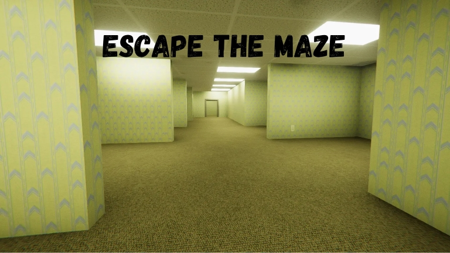

Escape The Maze - O Jogo
===

Sobre
---
Escape The Maze é um jogo de exploração de labirintos temáticos feito na Unity. As fases desse jogo consistem em labirintos (mazes) gerados proceduralmente por meio de um tipo de algoritmo de Grafos de busca em profundidade (backtracking). Cada labirinto conta com um coletável em sua saída que consiste em uma imagem deste embaralhada no formato 8-puzzle, também conhecido como slider puzzle. Tal figura é desembaralhada automaticamente através de um algoritmo de busca de Inteligência Artificial chamado A* (A estrela).

Como Jogar
---
### _Controles_

**WASD** - Movimentação Básica 

**Mouse** - Controle da Câmera em Primeira Pessoa

**Spacebar** - Movimento de Pulo

**Esc** - Menu de Pausa (pressione novamente para despausar)

### _Explore labirintos temáticos!_

### _Encontre o coletável ao final de cada fase!_

Guia de Instalação
---
Para instalar o jogo, siga as instruções abaixo:

1. Clone o repositório para o seu computador usando o comando 'git clone https://github.com/Shadod123/escape-the-maze.git'
2. Abra a pasta do jogo na branch **main** e execute o arquivo executável EscapeTheMaze.exe

Guia do Repositório
---
**[main](https://github.com/Shadod123/escape-the-maze/tree/main)** - contém a build do jogo (branch desejada se o intuito é testar a aplicação)

**[unity-project](https://github.com/Shadod123/escape-the-maze/tree/unity-project)** - contém o projeto da Unity do jogo (branch desejada se o intuito é desenvolver updates para o jogo)

Como Contribuir
---
Se você quiser contribuir para o desenvolvimento do jogo, siga as instruções abaixo:

1. Faça um fork deste repositório
2. Crie uma nova branch para a sua contribuição usando o comando 'git checkout -b minha-nova-feature'
3. Faça as suas alterações e faça um commit com uma mensagem descritiva do que foi feito usando o comando 'git commit -m "Minha nova feature"'
4. Faça um push das suas alterações para o seu repositório usando o comando 'git push origin minha-nova-feature'
5. Crie um novo Pull Request no repositório original

Inspirações
---
* [The Backrooms](https://backrooms.fandom.com/wiki/Backrooms_Wiki)
* [Escape The Backrooms](https://store.steampowered.com/app/1943950/Escape_the_Backrooms/)

Créditos
---
* [Unity Engine](https://unity.com/en)
* [Dungeon Generator](github.com/silverlybee/dungeon-generator) - SilverlyBee
* [Generic Pathfinder in Unity using C#](github.com/shamim-akhtar/tutorial-pathfinding/tree/part-2-8-puzzle) - Shamim Akhtar

Licença
---
Este projeto está licenciado sob a Licença MIT - consulte o arquivo [LICENSE](LICENSE) para obter detalhes.
